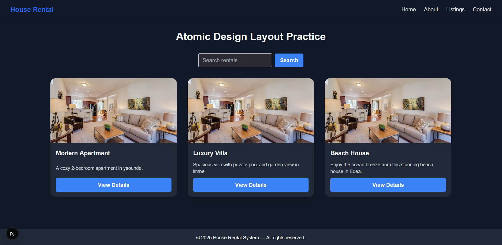
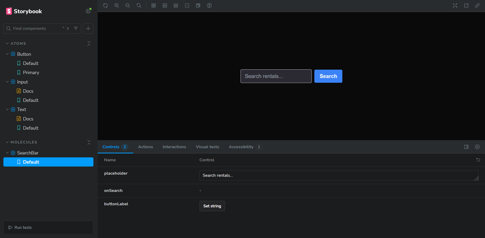

Atomic Next.js Design System

A modern, modular Atomic Design System built with Next.js 14, TypeScript, Tailwind CSS, and Storybook.
This project demonstrates how to structure reusable UI components following the Atomic Design methodology  atoms, molecules, organisms, templates, and pages.

Features
 Atomic Design structure (Atoms → Molecules → Organisms → Templates)
 Tailwind CSS for styling and responsiveness
 Reusable components for scalable front-end systems
 Storybook integration for visual documentation
 Built with Next.js App Router and TypeScript

 Project Structure

 atomic-next/
├── app/                  # Next.js app pages
├── components/
│   ├── atoms/            # Smallest UI elements (Button, Input, Text)
│   ├── molecules/        # Combinations of atoms (SearchBar)
│   ├── organisms/        # Larger UI blocks (Navbar, CardGrid)
│   └── templates/        # Page-level layout components
├── .storybook/           # Storybook configuration files
├── public/               # Static assets
├── app/globals.css       # Global styles (Tailwind)
├── package.json
├── tailwind.config.ts
├── postcss.config.js
└── README.md

Installation & Setup

1 Clone the repository 
- git clone https://github.com/yourusername/atomic-next.git
cd atomic-next
2 Install dependencies:
- npm install
3 Run the development server:
- npm run dev
4 Run Storybook
- npm run storybook
Visit http://localhost:6006

 Summary

| Level         | Description                     | Example                    |

| Atoms         | Smallest reusable UI units      | Button, Input, Text        |
| Molecules     | Group of atoms working together | SearchBar (Input + Button) |
| Organisms     | Larger composite components     | Navbar, CardGrid           |
| Templates     | Page-level structure wrappers   | MainLayout                 |
| Pages         | Final compositions with data    | Home Page (page.tsx)       |

---

##  Screenshot Preview

Below is a preview of the Atomic Design components:

